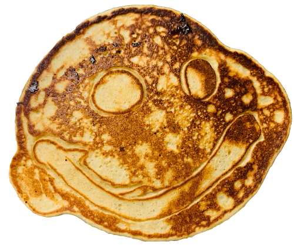

# Revenge of the Pancakes

[![MIT License][mit-license-image]][mit-license-url]
[![Dependency Status][dependency-status-image]][dependency-status-image]
[![Build Status][build-status-image]][build-status-image]

[![ForTheBadge built-with-love][built-with-love-image]](https://GitHub.com/Naereen/)

[mit-license-url]: LICENSE
[mit-license-image]: https://camo.githubusercontent.com/d59450139b6d354f15a2252a47b457bb2cc43828/68747470733a2f2f696d672e736869656c64732e696f2f6e706d2f6c2f7365727665726c6573732e737667
[dependency-status-image]: https://img.shields.io/badge/dependencies-none-brightgreen.svg
[build-status-image]: https://travis-ci.com/kitsune7/revenge-of-the-pancakes.svg?branch=master
[built-with-love-image]: http://ForTheBadge.com/images/badges/built-with-love.svg

A problem from a Google Code Jam project made available online in 2016

See the [problem specification](documentation/ProblemSpec.md) for more details on the problem itself.



## Technologies

This project is created with:

- Typescript 4.0.3
- Node.js 14.12.0
- Babel 7.11.6

## Setup

```bash
git clone https://github.com/kitsune7/revenge-of-the-pancakes
cd revenge-of-the-pancakes
npm ci
npm run build
```

`npm ci` is used here instead of `npm install` in order to take advantage of `package-lock.json`.

## Usage

```bash
npm start
```

After starting the program, type the number of test cases and press <Enter>.
Then, for each test case, type any combination of + and -. Each test case is
entered on a new line.

When you've finished giving all the test cases, the program will output the
minimum number of times each pancake must be flipped to have all the smiley
faces facing up.
